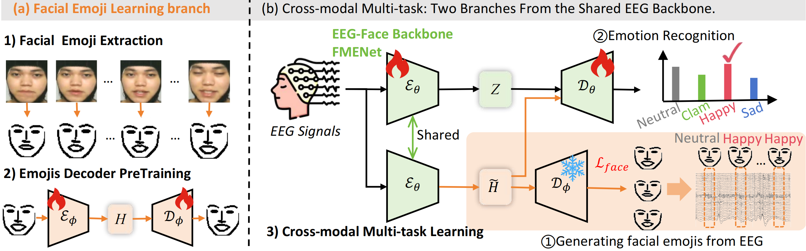

# README

## See the Emotion: A Facial Emoji Proxy Modeling for EEG Emotion Recognition

This repository contains the official PyTorch implementation of the paper:

**"See the Emotion: A Facial Emoji Proxy Modeling for EEG Emotion Recognition"**  
*Accepted at ICML 2026*

Jingjing Hu¹, Dan Guo¹²³,[Haofan Cheng¹, Zeng ying⁴, Zhan Si⁵, Jinxing Zhou⁶, Meng Wang¹²³

¹ Hefei University of Technology  
² Institute of Artificial Intelligence, Hefei Comprehensive National Science Center  
³ The Key Laboratory of Knowledge Engineering with Big Data, Hefei University of Technology  
⁴ Information Engineering University  
⁵ University of Science and Technology of China  
⁶ MBZUAI

> **Links:** [Paper (arXiv)]() | [Project Page]() | [Dataset]() *(coming soon)*

---

## Overview

Existing EEG-based emotion recognition models remain opaque "black boxes," lacking semantic grounding between abstract neural features and human-interpretable states. This paper reframes EEG explainability as a **cross-modal generation task**, shifting the paradigm from feature attribution to behavioral visualization.

We introduce **Facial Emoji Proxy Modeling (FELB)** , a novel framework that translates high-dimensional EEG signals into identity-anonymized facial emojis. Our approach:

- **FMENet**: A specialized backbone capturing expression-relevant spatial synergies and multi-scale temporal dynamics
- **FELB**: A facial emoji learning branch that treats emoji reconstruction as a structured semantic regularizer
- **Privacy-preserving**: Generates identity-anonymized emoji visualizations while achieving state-of-the-art accuracy

<p align="center">
  
  <br>
  <em>Figure: EEG-to-Emoji translation framework overview.</em>
</p>

---

## Datasets

This work uses three datasets:

| Dataset |  Download | EEG Channels | Emotions | Subjects | Face Data |
|---------|-------------|-------------|----------|----------|-----------|
| **[EAV](https://www.nature.com/articles/s41597-024-03838-4)** |**[Kaggle](https://www.kaggle.com/datasets/jingjinghuhu/eva-feat)**| 30 | 5 (Neutral, Anger, Happiness, Sadness, Calmness) | 42 | ✅ |
| **[MMER](https://www.nature.com/articles/s41597-024-03676-4)** | -------------|18 | 3 (Positive, Negative, Mixed) | 38 | ✅ |
| **[SEED](https://bcmi.sjtu.edu.cn/~seed/)** | -------------|62 | 3 (Positive, Neutral, Negative) | 15 | ❌ (zero-shot) |

## Citation

If you find this work useful, please cite:

```bibtex
@inproceedings{hu2026see,
  title={See the Emotion: A Facial Emoji Proxy Modeling for EEG Emotion Recognition},
  author={Hu, Jingjing and Guo, Dan and Cheng, Haofan and Zeng, Ying and Si, Zhan and Zhou, Jinxing and Wang, Meng},
  booktitle={International Conference on Machine Learning (ICML)},
  year={2026}
}
```

---

## License

This project is licensed under the MIT License. See the [LICENSE](LICENSE) file for details.

---

## Acknowledgements

We thank the authors of EAV, MMER, and SEED for making their datasets publicly available.

---

## Contact

For questions or issues, please open an issue on GitHub or contact: Jingjing Hu: [xianhjj623@gmail.com]

---

## Ethical Considerations

This work is intended for research purposes in affective computing and brain-computer interfaces. The facial emoji proxy is **privacy-preserving by design** — it generates identity-anonymized visualizations and does not reconstruct identifiable facial features. We strongly discourage any use of this technology for non-consensual surveillance, emotional profiling, or high-stakes decision-making without proper oversight. See the paper's Impact Statement (Appendix F) for detailed discussion.
